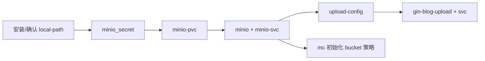

# gin_blog_upload

基于 Gin 的独立文件上传微服务，为 `gin_blog` / `gin_blog_fronted` 提供统一上传能力。文件存储在 **MinIO**，通过 HTTP 返回可访问 URL。

## 功能概览

- 提供上传接口：`POST /api/v1/files`
- 按业务类型分目录存储对象
- 自动创建 MinIO Bucket（不存在时）
- 自动识别图片 `Content-Type`（避免浏览器无法预览）
- 与主博客服务 `gin_blog` 解耦，可独立扩缩容

## 与主项目关系

```
浏览器
  └─ gin_blog_fronted (Nginx :30080)
        ├─ /api/*        -> gin_blog (backend-svc:9090)
        │                    └─ POST /file/opt/upload -> 转发到 gin_blog_upload
        ├─ /upload/*     -> gin_blog_upload (gin-blog-upload-svc:9091) [可选直连]
        └─ /minio/*      -> MinIO (minio-svc:9000) [图片访问]

gin_blog_upload
  └─ 写入 MinIO: <bucket>/<type>/uploads/<filename>
```

主后端需在 ConfigMap 中配置：

```yaml
UPLOAD_SERVICE_URL: "http://gin-blog-upload-svc:9091/api/v1/files"
```

## 目录结构

```
gin_blog_upload/
├── cmd/server/main.go          # 入口
├── internal/
│   ├── config/config.go        # 环境变量配置
│   ├── handler/upload.go       # HTTP 处理
│   ├── service/file_service.go # MinIO 上传逻辑
│   ├── middleware/recover.go
│   └── model/response.go
├── Dockerfile
├── go.mod
├── k8s/                        # Kubernetes 清单
│   ├── minio_secret.yaml
│   ├── minio-pesistent-volumn.yaml
│   ├── minio_deploy.yaml
│   ├── minio_service.yaml
│   ├── upload-config.yaml
│   ├── gin_blog_upload_deploy.yaml
│   └── upload-service.yaml
└── README.md
```

## 文件类型与存储路径

| 前端 `type` 参数 | MinIO 对象前缀 |
|------------------|----------------|
| `avatar`         | `avatar/uploads/` |
| `background`     | `background/uploads/` |
| `image`          | `image/uploads/` |
| 其他             | `misc/uploads/` |

示例对象 Key：

`avatar/uploads/1d8be876355c0b6252f881466550ccf720260429131924.png`

## API 说明

### 上传文件

- **URL**: `POST /api/v1/files`
- **Content-Type**: `multipart/form-data`

| 字段 | 必填 | 说明 |
|------|------|------|
| `type` | 是 | `avatar` / `background` / `image` |
| `file` | 是 | 文件字段（编辑器场景可能用数字 key，如 `0`） |

**成功响应示例：**

```json
{
  "code": 0,
  "msg": "文件上传成功",
  "data": [
    {
      "url": "/minio/gin-blog-upload/avatar/uploads/xxx.png",
      "pos": "file"
    }
  ]
}
```

> `url` 由 `MINIO_PUBLIC_BASE` 决定。推荐配置为同源路径 `/minio`，避免写死 IP/端口。

## 环境变量

| 变量 | 默认值 | 说明 |
|------|--------|------|
| `UPLOAD_SERVICE_PORT` | `9091` | 服务监听端口 |
| `UPLOAD_ROOT` | `./uploads` | 历史字段，MinIO 模式下不使用本地落盘 |
| `MINIO_ENDPOINT` | `127.0.0.1:9000` | MinIO 地址（集群内用 Service，如 `minio-svc:9000`） |
| `MINIO_ACCESS_KEY` | `minioadmin` | 访问密钥 |
| `MINIO_SECRET_KEY` | `minioadmin` | 访问密钥 |
| `MINIO_BUCKET` | `gin-blog-upload` | 存储桶名称 |
| `MINIO_USE_SSL` | `false` | 是否 HTTPS 连接 MinIO |
| `MINIO_PUBLIC_BASE` | 空 | 对外访问前缀，推荐 `/minio` 或 `http://<域名>/minio` |

### `MINIO_PUBLIC_BASE` 推荐配置

| 场景 | 配置值 | 返回 URL 示例 |
|------|--------|---------------|
| 同源（推荐） | `/minio` | `/minio/gin-blog-upload/avatar/uploads/xxx.png` |
| 固定域名 | `https://blog.example.com/minio` | `https://blog.example.com/minio/gin-blog-upload/...` |

不建议写集群内 DNS（如 `minio-svc.default.svc`），浏览器无法直接访问。

## 本地开发

### 前置条件

- Go 1.22+
- 可访问的 MinIO 实例

### 启动 MinIO（Docker 示例）

```bash
docker run -d --name minio \
  -p 9000:9000 -p 9001:9001 \
  -e MINIO_ROOT_USER=minioadmin \
  -e MINIO_ROOT_PASSWORD=minioadmin123 \
  minio/minio server /data --console-address ":9001"
```

### 启动上传服务

```bash
cd gin_blog_upload
go mod tidy
go run ./cmd/server
```

环境变量示例（PowerShell）：

```powershell
$env:MINIO_ENDPOINT="127.0.0.1:9000"
$env:MINIO_ACCESS_KEY="minioadmin"
$env:MINIO_SECRET_KEY="minioadmin123"
$env:MINIO_BUCKET="gin-blog-upload"
$env:MINIO_PUBLIC_BASE="/minio"
go run ./cmd/server
```

### 本地上传测试

```bash
curl -X POST "http://127.0.0.1:9091/api/v1/files" \
  -F "type=avatar" \
  -F "file=@./test.png"
```

## Docker 构建与运行

### 构建镜像

```bash
cd gin_blog_upload
docker build -t gin_blog_upload:latest .
```

### 运行容器

```bash
docker run -d --name gin_blog_upload \
  -p 9091:9091 \
  -e MINIO_ENDPOINT=host.docker.internal:9000 \
  -e MINIO_ACCESS_KEY=minioadmin \
  -e MINIO_SECRET_KEY=minioadmin123 \
  -e MINIO_BUCKET=gin-blog-upload \
  -e MINIO_PUBLIC_BASE=/minio \
  gin_blog_upload:latest
```

## Kubernetes 部署

清单位于 `k8s/` 目录，命名空间均为 `default`。

### StorageClass 与 local-path（MinIO PVC 前置条件）

`minio-pesistent-volumn.yaml` 中 PVC 指定了 **`storageClassName: local-path`**，集群必须存在名为 `local-path` 的 StorageClass，且由 **Provisioner 动态创建** 卷；仅手动创建 PV 不会自动满足该 PVC。

| 集群类型 | 通常情况 |
|----------|----------|
| **K3s / K3d** | 已内置 `local-path`，一般无需安装 |
| **kubeadm / 自建集群** | 需自行安装 [local-path-provisioner](https://github.com/rancher/local-path-provisioner) |
| **云厂商** | 可改用云盘 StorageClass，并修改 yaml 中的 `storageClassName` |

**0. 检查是否已有 local-path**

```bash
kubectl get storageclass
# 应能看到 NAME 为 local-path，且 PROVISIONER 为 rancher.io/local-path
```

**0.1 若没有，安装 local-path-provisioner（kubeadm 等环境）**

```bash
kubectl apply -f https://raw.githubusercontent.com/rancher/local-path-provisioner/v0.0.30/deploy/local-path-storage.yaml

# 等待 Pod 就绪
kubectl rollout status deploy/local-path-provisioner -n local-path-storage --timeout=120s

# 可选：设为默认 StorageClass
kubectl patch storageclass local-path -p '{"metadata":{"annotations":{"storage.kubernetes.io/is-default-class":"true"}}}'
```

**0.2 再次确认**

```bash
kubectl get storageclass local-path
```

**0.3 创建 PVC 后检查绑定**

```bash
kubectl apply -f minio-pesistent-volumn.yaml
kubectl get pvc minio-pvc -n default
# STATUS 应为 Bound；若长期 Pending，先完成 local-path 安装再 describe pvc 排查
kubectl describe pvc minio-pvc
```

> 若使用其他 StorageClass（如 `nfs-client`、`standard`），请改 `minio-pesistent-volumn.yaml` 中的 `storageClassName`，并确保对应 Provisioner 已安装。

### 资源一览

| 文件 | 资源 | 名称 | 说明 |
|------|------|------|------|
| `minio_secret.yaml` | Secret | `minio-secret` | MinIO 根账号 |
| `minio-pesistent-volumn.yaml` | PVC | `minio-pvc` | MinIO 数据盘 20Gi |
| `minio_deploy.yaml` | Deployment | `minio` | MinIO 单副本 |
| `minio_service.yaml` | Service | `minio-svc` | API `:9000`，控制台 `:9001` |
| `upload-config.yaml` | ConfigMap | `gin-blog-upload-config` | 上传服务环境变量 |
| `gin_blog_upload_deploy.yaml` | Deployment | `gin-blog-upload` | 上传服务 2 副本 |
| `upload-service.yaml` | Service | `gin-blog-upload-svc` | 集群内 `:9091` |

### 部署顺序

必须先拉起 MinIO，再部署上传服务（上传服务启动时会检查/创建 Bucket）。



```bash
cd gin_blog_upload/k8s

# 0. StorageClass（见上文「StorageClass 与 local-path」）
kubectl get storageclass local-path

# 1. MinIO 基础
kubectl apply -f minio_secret.yaml
kubectl apply -f minio-pesistent-volumn.yaml
# 确认 PVC 已 Bound 再继续
kubectl wait --for=jsonpath='{.status.phase}'=Bound pvc/minio-pvc -n default --timeout=120s
kubectl apply -f minio_deploy.yaml
kubectl apply -f minio_service.yaml
kubectl rollout status deploy/minio -n default

# 2. 上传服务（按需先改 upload-config / 镜像版本）
kubectl apply -f upload-config.yaml
kubectl apply -f gin_blog_upload_deploy.yaml
kubectl apply -f upload-service.yaml
kubectl rollout status deploy/gin-blog-upload -n default

# 3. 状态检查
kubectl get pods -l 'app in (minio,gin-blog-upload)'
kubectl get svc minio-svc gin-blog-upload-svc
```

### 清单说明

#### MinIO（`minio_deploy.yaml` + `minio_service.yaml`）

- 镜像：`minio/minio:latest`，数据目录挂载 PVC `minio-pvc`
- 集群内访问：`http://minio-svc:9000`（与 `upload-config` 中 `MINIO_ENDPOINT` 一致）
- 控制台：`minio-svc:9001`（仅集群内，需 `port-forward` 或 Ingress 暴露）

#### 上传服务（`gin_blog_upload_deploy.yaml` + `upload-service.yaml`）

- 镜像：`narutojxt/gin_blog_upload:v1.0.4`（发布新版本时改 tag 后重新 `apply`）
- 从 ConfigMap 注入通用配置，从 `minio-secret` 注入 `MINIO_ACCESS_KEY` / `MINIO_SECRET_KEY`
- **Service**：`port` 与 `targetPort` 均为 `9091`（勿写成 `8080`）
- Deployment 中 `MINIO_PUBLIC_BASE` 以 env 显式覆盖 ConfigMap，优先级高于 `upload-config.yaml`

#### ConfigMap（`upload-config.yaml`）

上传服务实际读取的变量：

| 键 | 当前值 | 说明 |
|----|--------|------|
| `UPLOAD_SERVICE_PORT` | `9091` | 监听端口 |
| `MINIO_ENDPOINT` | `minio-svc:9000` | 集群内 MinIO 地址 |
| `MINIO_BUCKET` | `gin-blog-upload` | 对象桶 |
| `MINIO_USE_SSL` | `false` | 集群内 HTTP |
| `MINIO_PUBLIC_BASE` | 见 yaml | 返回给前端的图片 URL 前缀 |

`BASE_URL`、`MAX_UPLOAD_MB`、`ALLOWED_EXT` 为预留字段，当前 Go 代码未读取，可忽略或后续扩展使用。

**部署前建议修改：**

1. `upload-config.yaml` 与 `gin_blog_upload_deploy.yaml` 中的 `MINIO_PUBLIC_BASE`  
   - 前端经 NodePort `30080` + Nginx `/minio` 代理时，推荐：  
     - 同源相对路径：`/minio`（不写 IP）  
     - 或完整地址：`http://<你的节点IP>:30080/minio`  
   - 勿使用集群 DNS（`minio-svc`）或错误端口（如 `30000`），否则浏览器无法加载图片。

2. `gin_blog_upload_deploy.yaml` 中的镜像 tag。

3. `minio-pesistent-volumn.yaml` 的 `storageClassName`（非 `local-path` 环境需改成集群实际 StorageClass，并安装对应 Provisioner）。

### 卸载

```bash
cd gin_blog_upload/k8s
kubectl delete -f upload-service.yaml -f gin_blog_upload_deploy.yaml -f upload-config.yaml
kubectl delete -f minio_service.yaml -f minio_deploy.yaml -f minio-pesistent-volumn.yaml -f minio_secret.yaml
# 注意：删除 PVC 会清空 MinIO 数据，请确认后再删 minio-pvc
```

### 与主博客联动

`gin_blog` 的 ConfigMap 需包含（不在本目录，需在主项目 k8s 中配置）：

```yaml
UPLOAD_SERVICE_URL: "http://gin-blog-upload-svc:9091/api/v1/files"
```

前端 `gin_blog_fronted` 的 Nginx 需代理 `/minio/` → `minio-svc:9000`（见下文）。

## 前端 / Ingress / Nginx 接入

### 主后端转发（必须）

`gin_blog` ConfigMap：

```yaml
UPLOAD_SERVICE_URL: "http://gin-blog-upload-svc:9091/api/v1/files"
```

### 前端 Nginx（NodePort 30080 场景）

在 `gin_blog_fronted/nginx.conf` 中配置：

```nginx
location /api/ {
    proxy_pass http://backend-svc:9090/;
}

location /minio/ {
    proxy_pass http://minio-svc:9000/;
}
```

页面与图片均通过 `30080` 访问时，请在 `k8s/upload-config.yaml`（或 Deployment env）将 `MINIO_PUBLIC_BASE` 设为 `/minio` 或 `http://<节点IP>:30080/minio`。

### Ingress（可选）

若使用 Ingress，可增加 `/upload` 与 `/minio` 路由；`host` 请使用域名，不要写 IP。

## MinIO Bucket 权限（图片直链必须）

上传后浏览器要能直接访问对象，需给 Bucket 开启匿名下载：

```bash
kubectl run mc-tmp --image=minio/mc --restart=Never --overrides='{"spec":{"containers":[{"name":"mc-tmp","image":"minio/mc","command":["sleep","3600"]}]}}'
kubectl wait --for=condition=Ready pod/mc-tmp --timeout=60s

kubectl exec -it mc-tmp -c mc-tmp -- mc alias set myminio http://minio-svc:9000 minioadmin minioadmin123
kubectl exec -it mc-tmp -c mc-tmp -- mc mb myminio/gin-blog-upload
kubectl exec -it mc-tmp -c mc-tmp -- mc anonymous set download myminio/gin-blog-upload

kubectl delete pod mc-tmp
```

## 验证清单

1. **上传接口**

```bash
kubectl port-forward -n default svc/gin-blog-upload-svc 19091:9091
curl -X POST "http://127.0.0.1:19091/api/v1/files" -F "type=avatar" -F "file=@/path/to/test.png"
```

确认返回 `code=0`，且 `url` 为 `/minio/...` 或正确域名路径。

2. **对象是否写入 MinIO**

```bash
kubectl exec -it mc-tmp -c mc-tmp -- mc ls --recursive myminio/gin-blog-upload
```

3. **图片是否可访问**

```bash
curl -I "http://<前端入口>/minio/gin-blog-upload/avatar/uploads/<filename>.png"
```

预期：`HTTP/1.1 200 OK`，`Content-Type: image/png`（或对应图片类型）。

## 常见问题

### 1. 上传成功但 MinIO 里没有文件

- 检查 `gin_blog` 是否已配置并生效 `UPLOAD_SERVICE_URL`
- 检查 upload Pod 日志是否有 `POST /api/v1/files` 请求
- 确认 `MINIO_ENDPOINT` 指向正确的 `minio-svc:9000`

### 2. 返回 `/static/...` 而不是 `/minio/...`

- 运行中的 `gin_blog_upload` 镜像版本过旧，需重新构建发布
- 或 `MINIO_PUBLIC_BASE` 未配置/未注入

### 3. 图片 URL 200 但浏览器不显示

- 检查 `Content-Type` 是否为 `image/*`（旧对象需重新上传）
- 避免页面在 `30080`、图片在不可达端口（如 `30780`/`30000`），优先同源 `/minio`
- 检查 URL 是否被错误拼接（如 `30080/192.168.x.x:30780/...`）

### 4. MinIO 403 AccessDenied

- 执行 `mc anonymous set download` 为 bucket 开启匿名读

### 5. MinIO 404 NoSuchKey

- 对象不存在或文件名不一致，重新上传并以后端返回 URL 为准

## 版本发布建议

```bash
# 构建并推送（版本号与 k8s/gin_blog_upload_deploy.yaml 保持一致）
docker build -t narutojxt/gin_blog_upload:v1.0.5 .
docker push narutojxt/gin_blog_upload:v1.0.5

# 方式一：改 yaml 后 apply
# 编辑 k8s/gin_blog_upload_deploy.yaml 的 image tag
kubectl apply -f k8s/gin_blog_upload_deploy.yaml
kubectl rollout status deploy/gin-blog-upload -n default

# 方式二：直接 set image
kubectl set image deploy/gin-blog-upload -n default \
  gin-blog-upload=narutojxt/gin_blog_upload:v1.0.5
kubectl rollout status deploy/gin-blog-upload -n default
```

## License

内部项目组件，遵循仓库整体许可策略。
